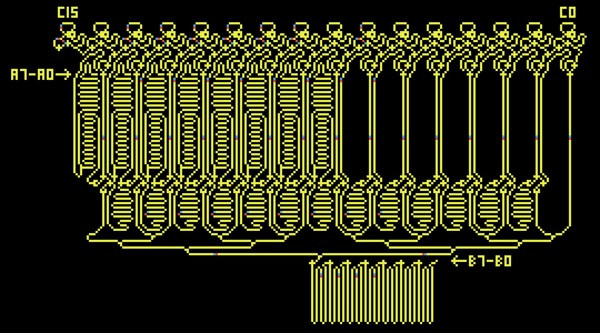
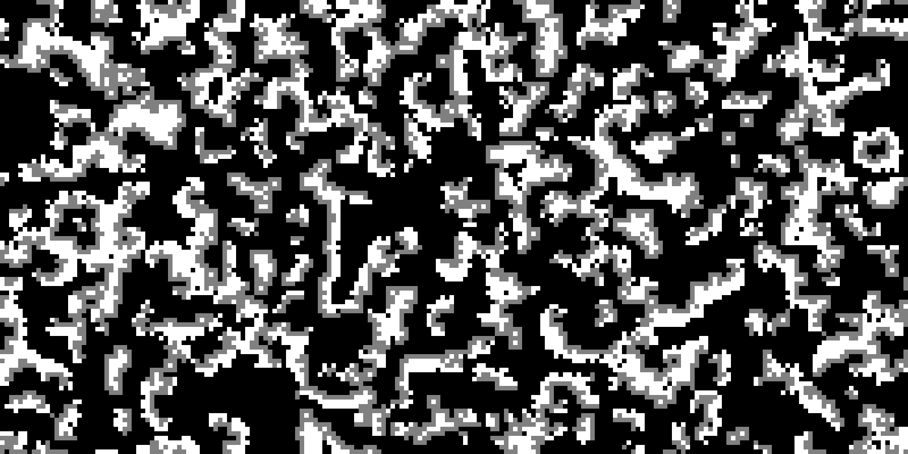
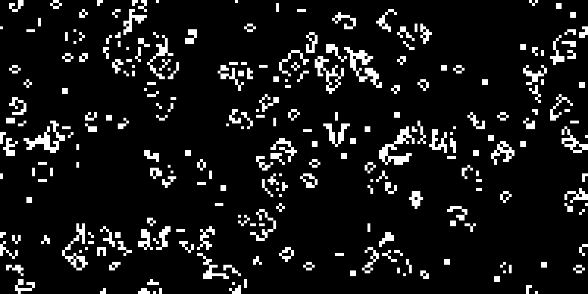

# PyCA

PyCA is a Python package and command line tool for running cellular automata simulations. Currently PyCA supports Conway's Game of Life, Langton's Ant, Predator Prey, Brian's Brain, and Wire World. PyCA is built on top of Pygame and is designed to be easy to use and extend.

Notably PyCA allows for cellular automata to be described in RLE format, which is a simple format for describing patterns in cellular automata. If no RLE file is provided PyCA will generate a randomised initial state. PyCA also allows for the creation of custom cellular automata by subclassing the base `Automaton` class.

<p align='center'>
  
</p>

## Installation and Usage

Before installing PyCA, consider using a virtual environment for the installation to avoid conflicts with other Python packages.

```sh
python -m venv .venv
source .venv/bin/activate
```

Clone the repository and install the package.

```sh
git clone https://github.com/josh-m-m/pyca.git
cd pyca
pip install .
```

Verify that `pyca` was installed successfully via `pyca --version`.

Shell completion is available for your shell and can be viewed with `pyca --show-completion` or installed with `pyca --install-completion`.

The PyCA command line tool can be used to run cellular automata simulations. PyCA will generate a randomised initial state if no RLE file is provided. To run a cellular automaton from an RLE file, use the following command:

```sh
pyca AUTOMATON [OPTIONS]
```
where `AUTOMATON` is the name of the automaton to run (e.g. `game_of_life`) or the path to an RLE file (e.g. `examples/game_of_life/pyca.rle`). Options can be viewed with `pyca --help`.

### Importing PyCA in Python

To use PyCA in Python, import the relevant automaton class from the `pyca` package.

```python
from pyca import GameOfLife

# Create and run a randomised instance of Conway's Game of Life
GameOfLife(grid_dims=(200, 100), cell_size=10, frame_rate=30)

# Create and run a instance of Conway's Game of Life from a RLE file
GameOfLife('examples/game_of_life/pyca.rle')
```
PyCA supports the creation of custom cellular automata by subclassing the base `Automaton` class.

### Custom Grids with RLE

To run a cellular automaton from an RLE file, use the following command:

```sh
pyca examples/game_of_life/pyca.rle
```

In order for PyCA to know which automaton to use, the RLE file must contain an `automaton` field in the header. The `automaton` field can be one of the following: `game_of_life`, `langtons_ant`, `predator_prey`, `brians_brain`, or `wire_world`.

Note that the grid is wrapped by default, so a layer of padding is suggested around all rle files to ensure that interactions between the edges of the automaton are handled correctly.

### Controls

`SPACE` key toggles pause/play.
`RIGHT ARROW` key advances one generation when paused.
`ESC` key quits the simulation.
`S` key saves the current frame as an image.

## Examples







